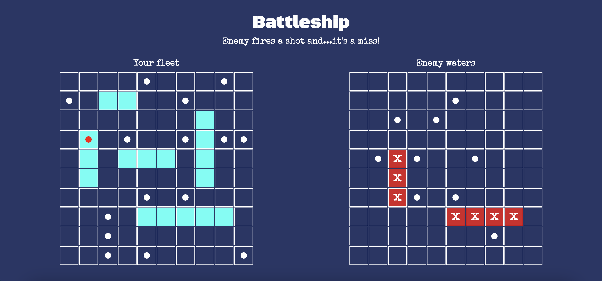

# Battleship

This project was completed as part of the Odin Project's Javascript Full Stack Curriculum

## [Live Demo](https://erinsophie.github.io/battleship/)

# Technologies Used

- HTML
- CSS
- Javascript

# Project goals

- The goal of this project was to learn how to incorporate testing into the development of a project using Jest. Getting into the habit of writing a test for a function before it has even been created felt odd at first, but I realised that the tests make you think about what result you want to see, so you can structure the function around how to get there. 

# Features

- Interactive browser-based game akin to the Hasbro™ board game, Battleship

